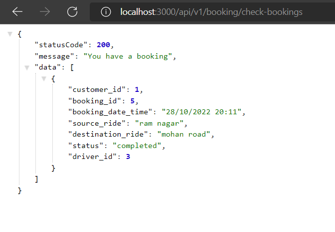

# Project-Uber-Web-App

##  This project is based on uber-app. We can SignUp/SignIn/SignOut as a Customer and Driver. Customer can book and cancel ride and check bookings via booking-id and Driver can also cancel the ride and update booking.  

## [UberWebApp](https://uberwebapp.onrender.com) - Wait for sometime on first click to wake up the server.
## [Screenshots](https://anshumanformal.github.io/UberWebApp/)
# Home page

## Currently there are 3 Tables in the web app

### 1. Customer Table Details

### 2. Driver Table Details

### 3. Booking Table Details

## Screenshots
### Book a ride

### Booking Cancelled

### Booking Completed

### Check Bookings

### Find Available Drivers

### Get All Customers

